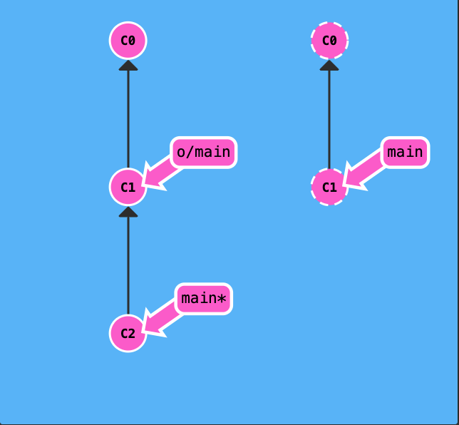

|       |                           | main == feature OR feature --> main | main --> feature | root --> main<br>        \\--> feature |
| ----- | :-----------------------: | :---------------------------------: | :--------------: | -------------------------------------- |
| main* |     git merge feature     |         Already up to date.         |   Fast forward   | 3-way merge                            |
| main* |    git rebase feature     |         Already up to date.         |  Fast forward*   | root --> feature --> delta-of-main     |
|       | git branch -f main HEAD~3 |                                     |                  |                                        |
|       |                           |                                     |                  |                                        |

# Local Repo
- *: In the animation tutorial, issuing `git rebase -i HEAD~4`. If this rebase changes nothing, then nothing changes. Only fast-forward is conducted. However, in the interactive interface, if there's any change, then a new rebase process is conducted.
- `git branch -f main HEAD~3` # forcely set a branch to a commit
- `git revert`: Given one or more existing commits, revert the changes that the related patches introduce, and record some new commits that record them. This requires your working tree to be clean (no modifications from the HEAD commit).
- `git cherry-pick <Commit1> <Commit2> <...>` # cherry pick C1 and C2 on current branch
- `git rebase -i HEAD~4`: start from the position HEAD~4 and re-apply the next 4 commits again.
- `git commit --amend`: not so clear yet.
- `git tag v1 C1`: put a tag `v1` to the `C1` commit. When `C1` is not provided, the tag is attached to `HEAD`
- `git desribe <ref>`: where `<ref>` is anyting git can resolve into a commit. If not provided, `HEAD` will be used. The output will be like `<tag>_<numCommits>_g<hash>`
  - `git describe --tags` this actually works on my macbook. 
- `git checkout main^2`: find `main`'s second parent
  - `main^` and `HEAD~`is the first parent
  - `main^2` is the second parent
  - `git checkout HEAD~^2~2`: go to first parent, then 2nd parent, then 2 commits above.


# Remote Repo

## `remote-tracking branch` is immutable

- `git checkout origin/main; git commit`: This will create a new commit in a detached head mode. `origin/main` remains unchanged. This branch only update when the remote updates.

## `git fetch`
`git fetch` performs two main steps

- downloads the commits that the remote has but are missing from our local repo, and
- updates the remote-tracking branches in local repo

## `git pull`
During a pull operation, commits are downloaded onto `o/main` and then merged into the `main` branch. The implied target of the merge is determined from this connection.

## `git push`

During a push operation, work from the `main` branch was pushed onto the remote's `main` branch (which was then represented by `o/main` locally). The destination of the push is determined from the connection between `main` and `o/main`.

Long story short, this connection between `main` and `o/main` is explained simply by the "remote tracking" property of branches. The `main` branch is set to track `o/main` -- this means there is an implied merge target and implied push destination for the `main` branch.

Usage and Requirements:

- To push a local branch to the remote branch
- It only works when `origin/main` in local repo and the `main` branch in remote repo are the same.
- In other words. Locally, we should have `o/main --> main`. Remotely, there should not be any new commits after `o/main`

In the following case, `git push` won't work.

  - 

Solution using `rebase`: 

  - `git fetch; git rebase o/main; git push`. 
  - The first 2 commands can be replaced by `git pull --rebase`
  - 

Solution using `merge`: 

  - `git fetch; git merge o/main; git push`
  - The first 2 commands can be replaced by `git pull`
  - 

### personalized names for remote tracking branches

There are two ways to set this property. 

#### Way 1

The first is to checkout a new branch by using a remote branch as the specified ref. Running

```
git checkout -b totallyNotMain o/main
```

Creates a new branch named `totallyNotMain` and sets it to track `o/main`. 换句话说，从`origin/main`分支上check out出来的新的local branch，会自动关联`o/main`。掌握这个特性就好了。

Below is an example.


```
git checkout -b foo o/main; git pull
```


As you can see, we used the implied merge target of `o/main` to update the `foo` branch. Note how `main` doesn't get updated!!

This also applies for `git push`


```
git checkout -b foo o/main; git commit; git push
```


#### Way 2
Another way to set remote tracking on a branch is to simply use the `git branch -u` option. Running

```
git branch -u o/main foo
```

will set the `foo` branch to track `o/main`. If `foo` is currently checked out you can even leave it off:

```
git branch -u o/main
```

Below is an example


```
git branch -u o/main foo; git commit; git push
```


### Push arguments

```
git push <remote> <place>
```

#### example `git push origin main`
Go to the branch named "main" in my repository, grab all the commits, and then go to the branch "main" on the remote named "origin". Place whatever commits are missing on that branch and then tell me when you're done.

By specifying `main` as the "place" argument, we told git where the commits will come from and where the commits will go. It's essentially the "place" or "location" to synchronize between the two repositories.

Keep in mind that since we told git everything it needs to know (by specifying both arguments), it totally ignores where we are checked out! 换句话说，和我们当前处于哪个分支无关。

注意，下面情况下，使用`git push`会失败，Because `HEAD` is not checked out on a remote-tracking branch.


#### `git push origin <source>:<destination>`
This is commonly referred to as a colon refspec. Refspec is just a fancy name for a location that git can figure out (like the branch `foo` or even just `HEAD~1`).

Another example


```
git push origin foo^:main
```


Another example when the destination branch doesn't exist



```
git push origin main:newBranch
```


#### `git fetch origin <source>:<destination>`

```
git fetch origin foo

```

Git will go to the `foo` branch on the remote, grab all the commits that aren't present locally, and then plop them down onto the `o/foo` branch locally.

If `git fetch` receives no arguments, it just downloads all the commits from the remote onto all the remote branches...


### When `source` is `nothing

- `git push origin :side`: delete the remote-tracking branch locally and the `side` branch in remote repo.
- `git fetch origin :bugFix`: create a `bufFix` branch locally. That's it. There's no remote-tracking branch involved.

## `git pull`


- `git pull origin foo` is equal to: `git fetch origin foo; git merge o/foo`
- `git pull origin main` is equal to: `git fetch origin main; git merge o/main` based on current checkout branch
- `git pull origin bar~1:bugFix` is equal to: `git fetch origin bar~1:bugFix; git merge bugFix`
- `git pull origin main:foo` with checkout branch `bar`: We created a new branch locally named `foo`, downloaded commits from remote's `main` onto that branch `foo`, and then merged that branch into our currently checked out branch `bar`.


